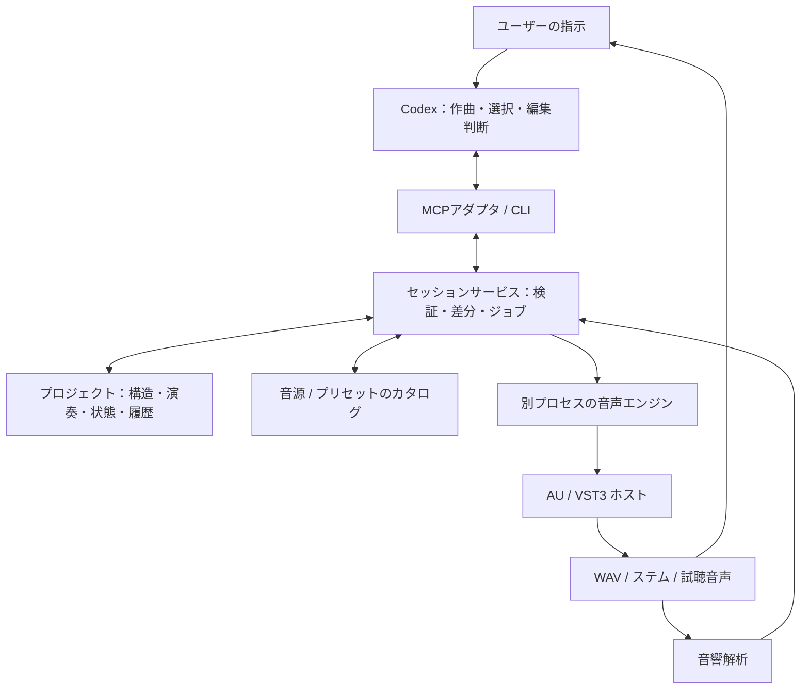

# APIで操作するDAW：設計提案

作成日：2026-09-09。改訂2：macOS / Windows共通実装を前提とする。実装と検証の到達点はREADME.mdに記録する。

## 1. 結論と製品の定義

実現可能。製品は「Codexなどのエージェントが、楽曲の構造・演奏・音色・ミックスをAPIで編集できる、ローカルの音楽制作エンジン」とする。独自の編集GUIは持たず、指示と変更報告は会話、確認は書き出した音声の試聴で行う。

対象はmacOS（arm64 / x86_64）とWindows（x64）。VST3を共通形式とし、AUはmacOSだけの追加バックエンドとする。CPUアーキテクチャが一致する64bitプラグインを対象とし、AUv3・32bit・異種CPUブリッジは初期版の対象外。音源はユーザーがインストール・利用準備を済ませたものを対象とする。対応製品の全機能を無条件に制御できるとはしない。インストール済みであることと、ライセンス・サンプル・初期設定が整い実際に鳴ることを区別する。

「GUIを表示せず制作できる」と「OSのGUI環境やメッセージループにも依存しない」は別要件。初期版はログイン中のmacOS / Windowsで動くバックグラウンドプロセスを想定する。JUCEのデスクトップランタイムを初期化し、プラグインのエディタ画面は生成しない。継続的なUI操作や非同期生成を必要とするプラグインは初期対応の対象外。初回認証や独自ブラウザ操作が必要な製品は、事前設定済みの状態を登録するか、未対応として返す。

## 2. 設計思想

- 正式な成果物は、再編集できる楽曲プロジェクトと音声ファイル。会話履歴やMIDIだけでは音源・ミックスを復元できない。
- AIは作曲・編曲・音色選択・改善案を担当する。時間管理、パラメータ変換、音声処理、保存はエンジンが担当する。
- 音楽的な意図と実際の演奏データを両方保存する。「サビ」「コード進行」「役割」の情報を残して、部分修正を可能にする。
- MCPは操作の入口。独立した内部APIを用意し、CLI・将来の別エージェントにも同じ機能を公開する。
- 曲の変更は差分単位。指定外の小節やトラックを作り直さず、取り消し・比較・復元できる。
- オフライン書き出しを先に完成させる。低遅延の演奏やライブ録音は後段階。

## 3. 構成



音声バッファをMCPに流さない。MCPは編集命令、検索結果、進捗、計測値、成果物の参照を扱う。音声処理は利用するPC上のネイティブプロセス内で完結させる。

CodexはローカルのSTDIOとStreamable HTTPのMCP接続をサポートしている。初期版はSTDIOアダプタからローカルサービスへ接続する構成とする。[Codex MCP公式資料](https://learn.chatgpt.com/docs/extend/mcp?surface=cli)

## 4. 技術スタック

| 層 | 推奨候補 | 役割・判断理由 |
| --- | --- | --- |
| MCP・制御API | TypeScript / Node.js | JSON Schema、入力検証、検索、非同期ジョブ管理 |
| 音声エンジン | C++20 / JUCE、独自の小さなオフラインシーケンサー | 同じソースでAU/VST3をホスト。プロジェクト形式とエンジンを分離 |
| エンジンとの通信 | 子プロセスと要求・応答JSONファイル | Node.js spawnで両OS共通。プラグインの標準出力がプロトコルを壊さない |
| 楽曲データ | バージョン付きJSON + MIDI + 音声・プラグイン状態ファイル | 編集対象を明示し、音源の内部状態も復元 |
| カタログ | 初期版JSON、拡張時SQLite | 初期版も構造化タグ・検索・件数制限を持つ |
| 音響解析 | 別ワーカー。必要に応じPythonを利用 | ラウドネス、ピーク、帯域、無音などの測定 |
| ビルド | CMake | ネイティブホストを再現可能にビルド |

JUCEはプラグインの生成管理と音声処理グラフを提供する。ただしグラフだけでトラック編集・プロジェクト保存・テンポ管理まで完成するわけではない。[AudioPluginFormatManager](https://docs.juce.com/master/classjuce_1_1AudioPluginFormatManager.html)、[AudioProcessorGraph](https://docs.juce.com/master/classjuce_1_1AudioProcessorGraph.html)

実装判断：初期の固定テンポ・オフライン処理はJUCE上の独自シーケンサーで実装する。別のDAWデータモデルへの依存を増やさず、共通JSON・MIDIスケジュールを直接実行するため。Tracktion Engineはリアルタイム編集・複雑なルーティングの段階で再評価する。JUCEとTracktionのライセンスは別であり、公開・配布方式と合わせて採用前に確認する。[Tracktion Engine](https://github.com/Tracktion/tracktion_engine)、[JUCE利用条件](https://juce.com/legal/juce-8-licence/)

代替案：

- **JUCEのみで独自シーケンサーを実装**：データ設計の自由度が高い。時間管理、遅延補正、オートメーション、ルーティングの開発負担が増える。Tracktionの制約が大きければこちらに切り替える。
- **DawDreamer**：PythonからVST音源・エフェクト・演奏・レンダリングを扱う既存プロジェクト。短い実証の候補だが、希望するAU対応・常駐運用・復元性を本番要件として別途検証する。[公式リポジトリ](https://github.com/DBraun/DawDreamer)
- **Appleの音声APIを直接利用**：AU中心のMac限定実装なら候補。VST3ホストは別に必要となり、今回は統一したホスト基盤を優先する。

## 5. 音源と音色の検索

プラグイン一覧と音色一覧を別々に管理する。シンセの製品名だけでは「柔らかいエレピ」「短いプラック」などの選択に不十分。

1. スキャナーを別プロセスで起動し、AU/VST3の識別子・製品名・バージョン・CPU種別・入出力・パラメータを収集する。
2. 公開プログラム一覧、標準プリセットファイル、登録済み状態から音色を収集する。
3. 製品・プリセットのメタデータ、ユーザーのタグ、短い試奏の解析結果を別々の出典として保存する。
4. role、音域、音の立ち上がり、明るさ、余韻、ジャンルタグ、利用可能性で絞り込む。
5. 上位5〜10件と選定根拠をCodexへ返す。大量の全リストは返さない。
6. 必要な候補だけ同じフレーズで試奏し、音声を比較できるようにする。

「このジャンルに適する」はAPIから取得できる確定事実ではない。タグや解析による推定として出典と信頼度を付ける。メタデータ検索から始め、音声埋め込みによる類似検索は後から追加する。

VST3にはプリセット状態やプログラム一覧の仕組みがあるが、各製品の独自ライブラリ全体を必ず列挙できるという契約ではない。メーカー独自形式の音色には製品別アダプタか事前登録した状態を使う。[VST3 Presets & Program Lists](https://steinbergmedia.github.io/vst3_dev_portal/pages/Technical+Documentation/Presets+Program+Lists/Index.html)

検索結果の例（架空のID）：

```json
{
  "sound_id": "sound_001",
  "plugin_id": "plugin_001",
  "name": "Warm Electric Piano",
  "roles": ["keys", "chords"],
  "tags": ["soft", "warm"],
  "tag_source": "user",
  "availability": "ready",
  "headless_status": "verified",
  "preset_load_method": "saved_state",
  "preview_asset_id": "preview_001"
}
```

互換性は一つの真偽値にまとめず、列挙・生成・音色読込・パラメータ変更・状態復元・オフライン処理を個別に記録する。CPU構成とプラグイン版も記録し、更新後は再検証する。AU版とVST3版は状態互換を仮定せず別の識別子にする。

## 6. 楽曲のデータモデル

| 要素 | 保存する内容 |
| --- | --- |
| Project | schema_version、revision、サンプルレート、依存関係 |
| Tempo / Meter map | 拍位置とBPM・拍子の変更 |
| Section | intro、verse、chorusなどの名前と区間 |
| Harmony | 指定コード進行、キー、適用区間 |
| Track | 役割、音源、音量、パン、送り先 |
| Clip / Notes | 音高、開始・長さ、velocity、MIDI channel、CC・奏法 |
| Audio asset | 元音声の参照・ハッシュ、配置、トリム |
| Processing graph | insert、send、bus、master、sidechain接続 |
| Automation | 対象パラメータ、時間位置、値、補間方法 |
| Plugin state | インスタンスごとの状態blob、形式・版、サンプル依存 |
| Edit history | 指示、適用差分、対象区間、変更前後revision |

ノートの基準時間は四分音符単位の有理数など、丸め誤差を管理できる表現とする。小節表示はテンポ・拍子マップから解決する。音声クリップは拍固定・秒固定のどちらかを明示する。ノートはレンダリング時にサンプル位置へ変換し、バッファ内オフセット付きで渡す。

コード記号だけで演奏は確定しない。Codexがボイシング・リズム・音域を決め、エンジンが具体的なノートに展開して保存する。生演奏らしさにはCC、ペダル、キースイッチ、音域、レガートなどの音源別情報が必要。ランダム化はseedと範囲を記録する。

例：「サビのピアノだけオクターブ上へ」はsection_idとtrack_idから対象ノートを特定し、その差分だけ適用する。「コードを変更」は関連ベース・伴奏をどこまで追従させるかを編集命令で明示する。

プロジェクト例：

```text
song.aidaw/
  project.json
  notes/
  states/
  assets/
  revisions/
  renders/
  manifest.json
```

project.jsonと参照アセットを正とする。Tracktionを使う場合は内部Editを派生実行状態として生成し、二つのデータモデルが独立に更新される構成を避ける。音源が不足していれば明示的に失敗させるか、ユーザーが選んだ代替を新revisionに記録する。

状態保存でも第三者プラグインの完全なビット一致は保証できない。ランダム動作やバージョン差があるため、承認したテイクはWAVとして固定する。プロジェクトの可搬性には有料サンプル等の依存関係も影響する。MIDIとステムの書き出しも用意する。

## 7. API設計

以下は提案APIであり、既存の実装ではない。細かいクリックの代用ではなく、意味のある編集単位で呼び出す。

| API | 内容 |
| --- | --- |
| system_capabilities | 対応形式・機能・制約・スキーマ版 |
| catalog_scan / catalog_search | 利用可能な音源・エフェクト・音色の検索 |
| sound_preview | 共通フレーズで音色を試奏 |
| project_create / project_inspect | 作成、構造・対象範囲の取得 |
| project_apply | トラック・ノート・構成・接続などを一括変更 |
| plugin_inspect / plugin_set_parameters | 公開パラメータの取得と設定 |
| project_checkpoint / project_restore | 比較点の保存と復元 |
| render_start / job_status / job_cancel | 固定revisionを非同期書き出し |
| audio_analyze / render_compare | 計測、音量を揃えた比較素材 |
| export_project | WAV、MIDI、ステム、編集可能なプロジェクト |

project_applyはbase_revision、request_id、operationsを受け取る。同じrequest_idの再送で重複ノートを作らない。古いrevisionなら競合を返す。構造化データの変更は原子的に確定し、プラグインの生成や状態復元は別ワーカーで検証してからreadyにする。外部プラグインの内部動作そのものをデータベースのトランザクションと同一視しない。

返却値にはrevision、applied_changes、warnings、検証結果、依存関係を含める。返却データはページング・範囲指定を使い、全ノートや全パラメータを毎回送らない。任意コード実行APIは基本機能に含めず、JSONの編集命令を検証する。

ジョブはqueued / running / succeeded / failed / cancelledを持ち、出力ハッシュと処理したrevisionを記録する。書き出し中の編集は別revisionとし、成果物と編集状態が混ざらないようにする。

## 8. パラメータ操作とマスタリング

公開パラメータからID・表示名・単位・現在値・変更可否を取得する。VST3では受け渡す値が0〜1の正規化値であり、表示単位の値と一致しない。名前だけで意味を断定せず、プラグインが提供する変換か、検証済みの製品別対応表を使う。変換できなければnormalized値として明示し、HzやdBへの変換を捏造しない。[VST3 Parameters and Automation](https://steinbergmedia.github.io/vst3_dev_portal/pages/Technical+Documentation/Parameters+Automation/Index.html)

よく使う製品には「eq.band1.frequency_hz」「compressor.attack_ms」のような共通概念と製品固有IDを結ぶアダプタを用意する。プリセット変更で値が変わるため、状態適用後に読み直す。公開されていない自動マスタリングボタン等を操作できるとはしない。

マスタリングの処理：

1. 未処理ミックスを保存する。
2. LUFS、true peak、ラウドネスレンジ、帯域エネルギー、ステレオ相関、クリップ・無音を測定する。解析手法・版・窓長も記録する。
3. ユーザーの目標に合わせ、利用可能なEQ・コンプレッサー・リミッターからチェーンを選ぶ。
4. 数値と設定根拠を付けた少数の候補を作る。
5. 書き出して再測定し、変更前後を音量を揃えて比較できるようにする。
6. 試行回数や変更幅を制限し、良かったrevisionへ戻せるようにする。

音響測定と美的判断は別。目標LUFS達成だけで「良いマスタリング」と判断しない。Codexが音声そのものを評価できるかは利用環境に依存するため、標準構成は計測値とユーザーの試聴で閉じる。自動の聴感評価モデルは交換可能な追加機能にする。

## 9. 音声エンジンの実装上の要点

- プラグインスキャンはタイムアウト付き別プロセス。クラッシュする製品を隔離し、他の登録を続行する。
- 初期版では曲全体のレンダリングを別プロセスに分離する。プラグインが落ちたらジョブを失敗にし、編集データは保持する。プラグイン単位の分離は後段階で、共有メモリや遅延の設計が必要。
- オーディオスレッドにJSON解析、ファイルI/O、AI通信、重いロックを入れない。
- MIDIノート、CC、テンポ同期情報、パラメータ変更を正しい時間に供給する。ノートオフ、サステイン解除、途中区間から再生する際の状態再現を扱う。
- バス数・チャンネル構成・sidechain対応を検証する。遅延補正とリバーブ等の余韻を含む書き出しを実装・試験する。
- バッファ境界だけのパラメータ反映で十分か、細かい時刻指定が必要かを機能ごとに定義する。JUCE/Tracktion経由での精度も実測する。
- オフライン高速処理が成立しない製品は、検証済みの実時間相当処理にフォールバックするか、未対応と返す。高速化率を保証しない。
- macOSでは各CPUネイティブ、Windowsではx64をビルド対象とし、異種CPU専用のブリッジは別機能とする。
- 書き出し途中のファイルは完成品として返さない。完了・再読込・長さ・非有限値・無音などの検査後に公開する。

## 10. 実装の順番と合格条件

### 段階1：互換性と音声出力の実証

ユーザーの主要AU音源1つ、VST3音源1つ、エフェクト1つを選定する。新しいライブラリの購入は前提にしない。

合格条件：GUI操作なしで生成→ノート入力→パラメータ変更→WAV書き出し→プロセス終了→状態復元→再書き出しができる。設定の読み戻し、MIDI時刻、無音でない出力、変更による音の差を確認する。第三者プラグインの再レンダリングは必要な許容誤差を定義し、自前の決定的テスト音源とは区別する。

この段階でホスト基盤の採用判断を確定する。既存ライブラリが動くことだけでは製品完成としない。

### 段階2：会話から一曲を作れるMVP

固定テンポ・拍子、複数トラック、MIDIノート、音色選択、音量・パン、insert、master、保存・再読込、MCP、WAV/MIDI出力を実装する。テンポ変更、複雑なsidechain、ライブ録音、外部MIDI機器は後段階。

合格条件：「90 BPM、指定コード進行、エレピ・ベース・ドラム、32小節」という指示で、ノートを含むプロジェクトと実音声ができる。続く「最後の8小節だけドラムを増やす」で指定範囲だけが変わり、再起動後も復元できる。

### 段階3：音色検索と編集品質

プリセットカタログ、試奏、奏法プロファイル、構成・コードを使った部分編集、候補比較、ステム書き出しを追加する。

合格条件：検索候補が実際にロード・発音でき、選択した音色が再読込後も復元される。インストール済み・未準備・未対応を区別できる。

### 段階4：ミックス・マスタリング

send/bus、sidechain、詳細オートメーション、遅延補正試験、解析・比較ループ、主要製品の共通パラメータ対応を追加する。

合格条件：変更前後を同一音量で比較でき、計測値・適用設定・音声・revisionが対応する。単なるパラメータ変更成功を音質改善と取り違えない。

### 段階5：日常利用の強化

再生・停止・シーク・ループ、ジョブ再開、プラグイン単位の障害分離、対応製品追加を進める。Windows VST3は初期からビルド対象とし、この段階で後付け移植する構成にしない。

## 11. 未確定事項

今後の調整事項は、優先する音源・エフェクトの製品名とバージョン、低遅延再生の優先度、個人利用か配布予定か。現時点では「macOS / Windows共通設計、オフライン優先」とし、手元のMacで実行検証、WindowsはCIと実機で別途検証する。

## 12. マルチプラットフォーム実装契約

- CMakeで同じC++ソースをApple Clang / MSVCからビルドする。OS分岐はプラグイン形式登録・標準検索パスだけに閉じ込める。絶対パスをプロジェクトの音源IDに使わない。
- TypeScript側はnode:path、node:os、spawn(shell:false)を使用する。Unix socket、シェル構文、macOS固有コマンドに依存しない。
- プラグインの実ファイルパスとJUCE記述XMLはマシン別カタログに保持し、プロジェクトはplugin_idで参照する。別マシンでは再スキャンし、未解決のIDを報告する。AU→VST3の状態互換を仮定しない。
- 内蔵の簡易音源は両OSで同一のレンダリング経路を使う。外部音源がない環境でもMCP→プロジェクト→WAV/MIDIの試験ができる。内蔵音源は外部プラグイン対応の代替検証とはしない。
- ビルドにはJUCE 8.0.13の固定コミットを使用する。開発用のVST3/AU試験音源をビルドフォルダ内に作り、システムにはインストールしない。
- 初期版は48kHz、固定テンポ・拍子、tick（PPQ=960）、ステレオ、ノート、トラック音量・パン、insert、master insert、状態保存、WAV/MIDI出力を対象とする。テンポマップ、CC、send、sidechain、LUFS/true-peak測定は後段階として明示する。
- 固定遅延補正：prepareToPlay後の各プラグイン遅延を合算し、各トラックの出力を最大トラック遅延に揃える。master遅延を加えた分だけレンダリングを延長し、先頭の共通遅延を除いて、指定フレーム数を保存する。バッファ境界に一致しない遅延もサンプル単位で扱う。途中で遅延が変われば失敗として再実行を要求する。上限は経路全体で10秒。ジョブには各トラック・master・除去サンプル数を保存する。
- API編集は単一ライター・revision照合・request_id冪等性を持つ。ディスクの排他ロックと一時ファイルからのrenameで、別CLIからの同時編集にも対応する。
- Windows CIには同じビルド、プロジェクト競合/復元試験、WAV/MIDI検査、VST3の発音・パラメータ・状態復元試験を登録する。CIを登録した事実とWindowsで合格した事実を分けて報告する。

現実的な最大の不確定要因は、MCP接続ではなく実際に使いたいプラグインの外部制御範囲。最初の成果物を、主要音源で状態保存まで通った小さなホストにする。その結果を基に対応範囲と開発見積もりを固める。
