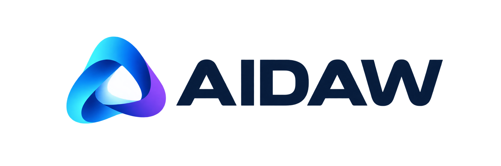

# AIDAWの正式ロゴ・アイコン

シアン・ブルー・バイオレットの帯が重なるマークと、濃紺のAIDAW文字を正式なブランドデザインとして採用しています。マークは「音が生まれる入口」を表します。

正式素材の保存先は `Docs/Assets/Brand/` です。以前の候補画像やRinとの組み合わせは検討案であり、正式ロゴとして使用しません。

## 素材と用途

| 素材 | 用途 | 形式 |
| --- | --- | --- |
| [横組みロゴ](../Assets/Brand/aidaw-logo-horizontal.png) | マークの右にAIDAW。ヘッダーや横長の紹介欄に使用 | 2172×724・透過PNG |
| [縦組みロゴ](../Assets/Brand/aidaw-logo-stacked.png) | マークの下にAIDAW。正方形の紹介枠や表紙に使用 | 1254×1254・白背景PNG |
| [アイコン](../Assets/Brand/aidaw-icon.png) | マーク単体。アプリやプロフィール等の識別に使用 | 1254×1254・淡い背景のPNG |
| [DECKアプリアイコン](../Assets/Brand/aidaw-deck-icon.png) | 濃紺の角丸ベースに正式マークを配置。DECKの識別に使用 | 1254×1254・外周透過PNG |

## 使い方

- 名称は大文字5文字の **AIDAW**。AIとDAWの間に空白を入れません。
- 縦横比・マークの向き・文字形・配色を保ち、引き伸ばしや切り取りを避けます。
- ロゴの周囲に余白を取り、濃紺の文字は明るい背景に置きます。
- 小さい表示では、文字付きロゴよりマーク単体のアイコンを使います。

DECK用はCore/Source/Desktop/assetsへPNG・ICNS・ICOを配置し、開発起動と配布アプリのアイコンに使用します。ICNS・ICOは採用PNGからサイズ・形式を変換したものです。

内蔵画像生成で作成しました。[横組みの生成プロンプト](../Assets/Brand/horizontal.prompt.txt)と[縦組み・アイコンの生成プロンプト](../Assets/Brand/variants.prompt.txt)を保存しています。

DECK用は同じ内蔵画像生成で作成し、外周を透過しました。[DECKアイコンの制作記録](../Assets/Brand/deck-icon.prompt.txt)を保存しています。
