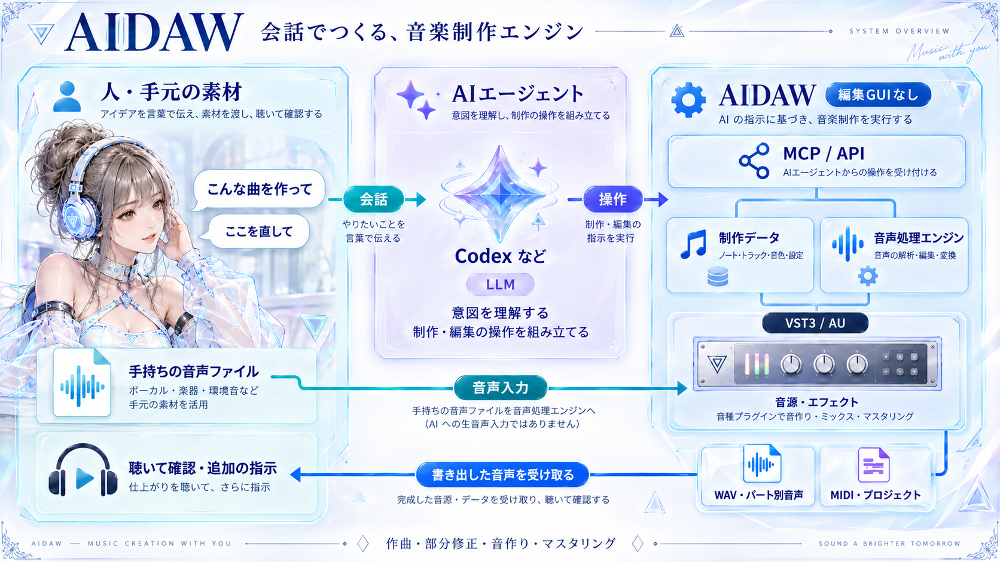

# AIDAW



Codex / Claude CodeなどからMCPで操作する、GUIのない音楽制作エンジン。TypeScriptの制御層とC++20 / JUCEのオーディオエンジンで、VST3 / AUを実際に鳴らして書き出します。

> **開発版（0.1.0）**：macOS arm64で実機検証済み。WindowsはCIでビルドと受け入れテストを行いますが、商用プラグインを含む実機検証は未完了です。互換性を保証する安定版ではありません。

## セットアップ

エージェントへ「このリポジトリをクローンして、AGENTS.md / CLAUDE.mdに従ってセットアップして」と依頼してください。

```sh
# macOS、Codexの場合
bash scripts/setup.sh --client codex
# 依存環境がある場合はmacOS / Windows共通
node scripts/setup.mjs --client both
```

Windowsの入口は `powershell -File scripts/setup.ps1 --client claude`。Node.js 22.13以降、CMake 3.22以降、C++開発環境、FFmpeg/ffprobeが必要です。

[自動セットアップ](docs/AUTO_SETUP.md) / [Codex・Claudeの詳細設定](docs/SETUP_CODEX_CLAUDE.md)。macOSで検証、WindowsはCI定義と実装があり実機未確認。GitHubへの公開はセットアップに含まれません。

## 別マシンからの操作

認証付きStreamable HTTPサーバーを `npm run start:http` で起動できます。クライアントに音源を置かず、アップロード・プラグイン処理・レンダリング・納品をサーバー側で行います。[起動・接続手順](docs/REMOTE_SERVER.md)。

## 機能

- MIDIノート・パート編集、SMF取り込み、保存状態付き音源、演奏同期パラメーター制御。
- トラックinsert、音量・パン、mute/solo、pre/post-fader send、独立FX return、master。
- 変更の下流だけを再レンダリング。採用した音声はハッシュ付きで保存。
- プラグイン報告遅延の補正、ワーカー分離、版を限定した初期化対策、保存したパラメーターの読み戻し検証。
- WAV・タグ付きMP3・MIDI、演奏素材・ミックスステム・FX return・premasterの書き出し。
- 収集済み素材とフリーズ音声を含む可搬bundle、依存検証、ソース/リファレンスの区別。
- プラグインと内部ライブラリの索引、試奏音声、呼び出し元による評価、エフェクトパラメーターDB。

標準MIDI・簡易音源への自動代用はしません。通常は `plugin_first`、明示されたテスト・スケッチ用途のみ `allow_basic` を使います。

## 制約

固定テンポ・ステレオ・48kHzのオフライン処理。リアルタイム再生/録音、テンポマップ、CC/サステイン、sidechain、bus間ルーティング、動的な遅延変更への追従は未対応。補助出力は主ミックスに自動合算しません。

AUはmacOSのみ。AUとVST3の状態変換、32bit/異種CPUブリッジはありません。Kontaktの任意NKI直接ロードは未実装で、索引作成とロード/試聴成功は別です。全製品の互換性を保証しません。

音楽の終止位置の自動判定、任意製品に共通するマスタリングの自動収束は未実装。音質評価は呼び出し元で行い、AIDAW用の別LLM/APIキーは不要です。

インストール済みプラグインを一括走査してローカルSQLite DBを更新し、パス・認証・状態を除いた可搬カタログをソースへ生成できます。

```sh
npm run inventory:plugins
```

公開用カタログと実機ローカルカタログの更新方法は [catalog/README.md](catalog/README.md) を参照してください。MCP/APIでは `catalog_inventory`、`catalog_inventory_resume`、`catalog_inventory_status`、`catalog_portable_export`、`catalog_reference_search` を使用します。

## 開発と検証

```sh
npm ci
npm run configure:native
npm run build:native
npm run build
npm test
node dist/cli.js system_capabilities
```

`npm run demo` は明示的な簡易音源の動作確認例です。通常の制作での音源選定例ではありません。`outputs/demo/` にWAV・MIDI・JSONを生成します。

実機商用テスト（インストール・認証済みmacOSの場合）：

```sh
AIDAW_TEST_NI=1 AIDAW_TEST_BBE=1 AIDAW_TEST_MODO=1 node --test tests/ni.test.mjs
```

サーバーの現状は単一所有者向けの遠隔実行です。音声処理は共通FIFOで常に1件、完成曲の取得は別経路です。キューの再起動復旧・多人数の権限分離は未実装です。[レビューとジョブキュー設計](docs/SERVER_REVIEW_AND_QUEUE_DESIGN.md)を参照してください。

## 実装資料

- [本体への統合監査・互換性と未対応範囲](docs/CORE_INTEGRATION_AUDIT.md)
- [プロジェクト形式・出力・DB](docs/IMPLEMENTATION_V2.md)
- [ミキサー・パートの再編集](docs/MIXER_GRAPH.md)
- [音源選定と内部ライブラリ](docs/INSTRUMENT_SELECTION.md)
- [マスタリングの共通原則](MASTERING.md)
- [初期アーキテクチャ設計](DESIGN.md)

曲固有のレシピや補助スクリプトは実行ソースに含めません。ホストの互換性修正は `native/` または `src/` に実装し、`tests/` で検証します。原音、プラグイン本体、プリセット、ローカル設定はGit対象外です。

JUCEソースは固定コミットをCMakeで取得します。このリポジトリには市販プラグインやサンプルライブラリを同梱しません。配布時はJUCE・依存SDKのライセンス条件を確認してください。

標準セットアップには **AIDAW GM（FluidR3）・EQ・Limiter・Reverb** が含まれます。手持ち音源がない環境での制作、またはユーザーが標準音源を希望する場合、AIDAW GMは `plugin_first` のまま明示的に選択できます。先に利用可能な音源・内部ライブラリを比較する方針と、指定された音源のロード失敗を黙って代用しない規約は維持します。詳細: [標準音源・エフェクト](docs/STARTER_PACK.md)。

## セキュリティとライセンス

脆弱性の報告と遠隔公開時の条件は [SECURITY.md](SECURITY.md)、開発参加手順は [CONTRIBUTING.md](CONTRIBUTING.md) を参照してください。本ソフトウェアは [GNU Affero General Public License v3.0 only](LICENSE) で公開します。依存物の告知は [NOTICE](NOTICE) にまとめています。
