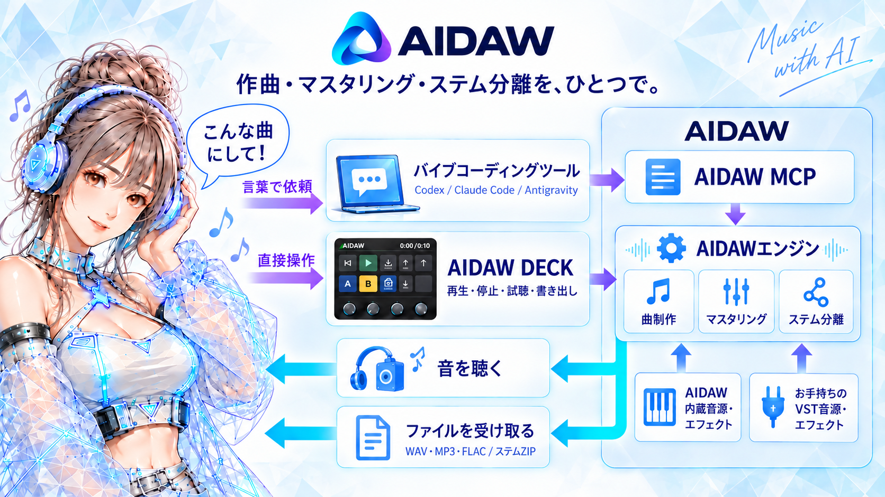

# AIDAW



> **AIエージェントへ：** 作業は [AGENTS.md](AGENTS.md) から該当する手順へ進んでください。このREADMEは人向けの紹介です。README自体の編集・説明時は対象本文を読んでください。

## 作曲・マスタリング・ステム分離を、AIDAWひとつで。

**思い描いた曲を、言葉から音へ。仕上げも、パート分けも、AIDAWで。**

**AIDAWは、無料で使えるオープンソースの音楽制作ソフトです。** AIDAW本体の利用料はかかりません。詳しくは [利用規約・ライセンス案内](Docs/User/TERMS.md) をご覧ください。

AIDAWは、AIに話しかけて音楽を作る **Vibe Coding DAW**。曲を作る標準音源、**MTSで採用していたGoldenTips相当のマスタリング**、音声を4パートに分けるステム分離を、最初から備えています。

別のDAWや有料プラグイン、分離専用アプリをそろえずに、制作から試聴・書き出しまで。編集はAIに頼み、再生や聴き比べは操作画面 **AIDAW DECK** で直接操作。専用コントローラーも必要ありません。

「曲を作りたい」「完成した曲を仕上げたい」「ボーカルと伴奏を分けたい」。その目的に合ったプロジェクトを選んで、すぐに制作を始められます。

## はじめ方

ローカルのファイル操作とコマンド実行ができる **Codex・Claude Code・Antigravityのいずれか** に、次の文章を送ってください。

```text
https://github.com/momuandteasteam/aidaw.git をクローンして、
AGENTS.mdに従ってAIDAWをセットアップしてください。
今使っているAIクライアントからの接続を確認し、AIDAW DECKを起動してください。
```

クローン済みなら、そのフォルダをAIで開いて「AIDAWをセットアップして」で始められます。AIがビルド、標準音源・エフェクト・分離モデルの導入、接続設定を進めます。認証・信頼確認が求められたら案内に従い、必要に応じてAIクライアントを再起動してください。

準備ができたら、以下の3つからやりたいことを依頼してください。**コード枠内はAIに送る依頼文**です。音声を使う場合は、ファイルを添付するか保存先を伝えます。

## 曲を作る

「落ち着いたピアノ曲を」「ベースをもっと前に」。作りたい音楽をAIに伝えて、標準音源 **AIDAW GM** で曲づくり。MIDIとオーディオのトラックを組み合わせ、演奏・音色・ミックスを調整できます。

```text
「夜の散歩」という曲制作プロジェクトを作成してください。
90 BPMの落ち着いた曲を、ピアノ・ベース・ドラムでまず8小節。
標準音源のAIDAW GMを使って、AIDAW DECKで聴けるようにしてください。
```

聴いた後は「ドラムを少し控えめに」「ピアノにリバーブを足して」と伝えれば、さらに調整できます。手持ちの対応音源やエフェクトも名前で指定できます。

## マスタリングする

完成した曲を読み込み、音色・広がり・低域・音圧を整えます。**GoldenTips方式を基準にしたEnhancer**と、8バンドEQ・Imager・BassMono・Limiterなどの標準エフェクトで、1曲からアルバムまで。変更前後をA/Bで聴き比べ、納得した音を選べます。

```text
マスタリングプロジェクト「ミニアルバム」を作成して、添付した3曲を読み込んでください。
曲ごとの音量感と音色を整え、変更前後をA/Bで聴き比べられるようにしてください。
```

GoldenTipsと同一の出力を保証するものではありません。処理方式の詳細は [標準エフェクトDSP](Docs/Contracts/STANDARD_DSP.md) を参照してください。

## ステム分離する

音声を **ボーカル・ドラム・ベース・その他** の4パートへ。別の分離アプリやサービスを用意せず、パートごとに聴いたり、ボーカルを外して伴奏にしたりできます。全ステムのZIP保存にも対応しています。

```text
ステム分離プロジェクトを作成して、添付した音声を分離してください。
全ステムをZIPで保存し、ボーカルをミュートした伴奏もWAVで書き出してください。
```

標準は **Spleeterの4ステムモデル**です。分離は推定処理のため、他パートの音が残る場合があります。セットアップで導入するDemucsを含め、方式とモデルの利用条件は [ステム分離](Docs/Contracts/SEPARATION.md) を参照してください。

## AIDAW DECKで聴く・操作する

**再生・停止・シーク・試聴・読み込み・書き出しを、手元で。** AIへの編集依頼と組み合わせて使うコントロール用GUIです。開いたプロジェクトはAIと共有され、編集前に対象を確認します。

AIDAW DECKはセットアップで導入されます。macOSはアプリケーション、Windowsはスタートメニューから起動できます。本体の更新後は、AIに「AIDAW DECKを更新して」と依頼してください。操作の詳細は [再生・試聴・書き出し](Docs/User/PLAYBACK.md) をご覧ください。

## 書き出す・保存する

音声は **WAV・MP3・FLAC** で書き出せます。曲制作のトラック別ステム、マスタリングの曲単位・アルバム全体にも対応しています。

```text
この曲をWAVとMP3で書き出してください。
編集を続けられるように、プロジェクトも.aidaw.zipでエクスポートしてください。
```

普段の作品は `Projects/` に保存されます。`.aidaw.zip` は編集データと履歴を持ち出すための形式です。以前の状態に戻したいときは、AIに「編集履歴を確認して、直前の変更前に戻して」と依頼できます。

## 使える音源・エフェクト・ファイル

標準搭載は **AIDAW GM、Gain、EQ（8バンド）、Limiter、Reverb、Enhancer、Imager、BassMono**。手持ちの **VST3**、macOSの **Audio Units／AU** も利用できます。インストール・認証済みの製品を名前で指定してください。すべての製品・プリセット形式への対応は保証していません。VST2は対象外です。

| 用途 | 対応形式 |
| --- | --- |
| 音声の読み込み | WAV・AIFF・FLAC・Ogg Vorbis。MP3などはOS・デコーダーに依存します。 |
| 音声の書き出し | WAV（24 bit）・MP3（320 kbps）・FLAC。48 kHz・ステレオ。 |
| 演奏データ | MIDIの読み込み・書き出し。 |
| 編集用プロジェクト | `.aidaw.zip`。使用する音源プラグインの導入は別途必要です。 |

音声処理は **48 kHz** です。異なるサンプルレートや読み込めない形式の素材は、AIに「原音を残して48 kHzのWAVへ変換してから読み込んで」と依頼してください。

## 対応環境・詳しい手順

**対応OS：Windows 11・macOS・Linux（未検証）**。現在は開発中です。機種専用コントローラー連携などの対応範囲は [要件と対応状況](Docs/Development/VERIFICATION.md) をご覧ください。

- 手動セットアップや既存環境の引き継ぎ：[クイックスタート](Docs/User/QUICKSTART.md)
- 別のPCを音声処理サーバーにする：[遠隔接続](Docs/User/REMOTE_SERVER.md)
- **0.0.1からの再出発と変更点：** [リリースノート](Docs/User/RELEASE_NOTES.md)
- 第三者コンポーネントの利用条件：[ライセンス](Docs/User/OPEN_SOURCE.md)

正式なロゴ・アイコンは [ブランド素材](Docs/User/BRAND.md) をご覧ください。

## 開発に参加する

AIと直した不具合や追加機能は、「この変更を作者に共有して、プルリクを作成して」と依頼してAIDAWへ還元できます。AIが変更とテストを確認し、GitHubにレビュー用の提案を送る準備を進めます。初回はGitHubへのログインが必要です。作品・音声・個人設定は共有対象に含めません。

開発する場合は [開発参加](Docs/Development/CONTRIBUTING.md)、構成を調べる場合は [ディレクトリ構成](Docs/Architecture/DIRECTORIES.md)、文書を変更する場合は [文書規約](Docs/Development/DOCUMENTATION.md) を参照してください。
