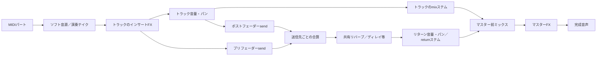

# パート再編集と内部ミキサー

2026-09-09。GUIを前提とせず、MIDI・音源・トラックFX・ミキサー・センドリターンを分離した。

## 再レンダーの単位

各段階の入力・設定・音声ハッシュを使い、変更していない段階はstate/frozenの確定音声を再利用する。プラグインbinary・engine・状態・テンポ／拍子・時間範囲も識別に含む。各パートの演奏は独立したテイクとして扱う。

| 変更 | 再生成する主な段階 |
|---|---|
| ベースのノート | ベース演奏とその下流、ベースが送られるreturn、ミックス |
| トラック音量／パン | フェーダー以降。演奏とインサートFXは再利用 |
| プリフェーダー送信元の音量 | returnの入力は変わらないので再利用 |
| センド量 | 対象sendの合算とreturn以降 |
| リターン音量／パン | リターンのフェーダー以降。共有FXは再利用 |
| マスターFX | 各パートとreturnを再利用してマスター処理 |

同じ設定でも演奏自体をやり直したい場合はrender_startのrerender_tracksにパートIDを指定する。生成し直したテイクが次回の再利用対象になる。jobのrender_graphに、各段階のreusedと識別キーを記録する。参照ファイルが壊れた場合やプラグインのbinaryを識別できない場合は再生成する。

## ミキサー操作

- mixer_inspect: トラック、センド、リターン、マスター、最後のofflineレンダーのメーターを読む。古いrevisionのメーターはstaleと表示する。
- project_apply / set_track: gain_db、pan、mute、solo、to_master、sendsを変更する。
- sends: bus_id、gain_db、position（pre_fader/post_fader）、enabled。既定はpost_fader。
- project_apply / set_bus: returnの音量、パン、mute、solo、FXを部分変更する。
- トラックmuteはmainとsendを止める。トラックsoloはそのトラックとそのsendを残す。return soloはmainを止め、returnへ入る送信は残す。muteを優先する。

メーターはリアルタイム表示ではない。接続のないチャンネルやミュートされたチャンネルも、時間位置の揃った無音ステムとして扱える。busから別busへの接続やsidechainは今回の範囲に含めない。

## 他のDAWへ渡す音声

- `<part>__instrument.wav`: 外部インサートとフェーダー前の楽器音声。
- `<part>__mix.wav`: トラック処理・音量・パン適用後のmain成分。
- `<return>__return.wav`: 共有FXとリターン音量・パン適用後の成分。
- `premaster.wav`: mix成分とreturn成分の合計。
- `master.wav`: マスター処理後。

**mixステムとreturnステムを、全てフレーム0から、ゲイン0 dBで合算するとpremasterになる。** instrumentファイルまで同時に足すと二重になる。非線形なマスター処理後のmasterと、素のステム合算が同じになるとはしない。

共有FXは設定されたプラグイン出力をそのままreturnへ送る。残響・反復だけを出す場合はFXをWet 100%に設定する。製品ごとの公開パラメーターを指定して設定し、名称から推測して勝手に変更しない。プラグイン側のDry成分を含めた設定なら、そのDryもreturnに含まれる。

reports/mixer.jsonとdelivery reportに経路、設定、ステムの役割、時間位置、再利用状況を残す。可搬projectにもミキサーのsnapshotを含める。

## MIDI読み込み

midi_inspectでSMF type 0/1を読み、midi_importで各MIDIトラックに音源を明示して取り込む。元PPQを960へ変換し、note-on/offと演奏タイミングを保持する。テンポ・拍子の取り込みはadopt_tempoで指定する。

現状は固定テンポ・固定拍子。CC、ピッチベンド、プログラム変更、SysEx等は黙って捨てず、notes_onlyを明示しない限り拒否する。可変テンポやSMPTE形式は未対応として拒否する。
